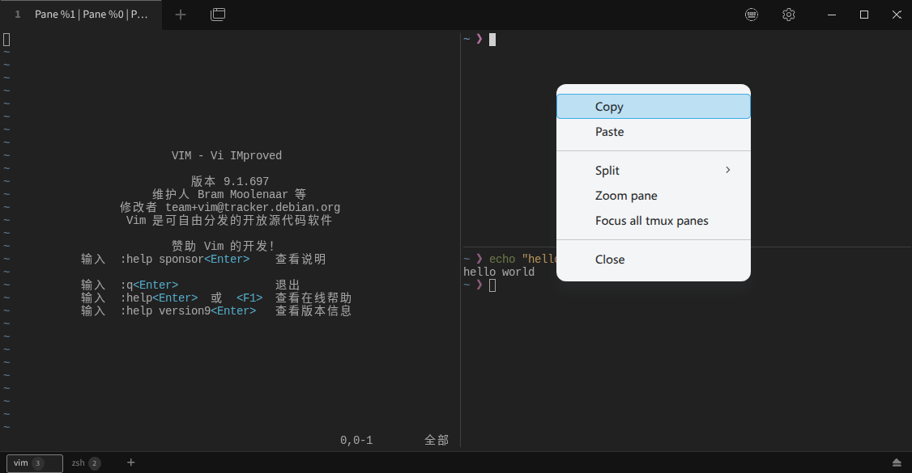

# tabby-tmux

[中文](README.zh-CN.md)

[](https://github.com/ruanimal/tabby-tmux/actions/workflows/build.yml)
[](https://www.npmjs.com/package/tabby-tmux)
[](https://opensource.org/licenses/MIT)

A [Tabby](https://tabby.sh/) plugin that provides tmux Control Mode integration, inspired by [iTerm2 tmux Integration](https://iterm2.com/documentation-tmux-integration.html).

## Features

- **Native UI integration** — Maps tmux windows and panes into native Tabby components
- **Session persistence** — tmux sessions survive Tabby restarts; reconnect via `tmux -CC attach`
- **Window bar** — Collapsible bottom bar for switching tmux windows, with support for creating new windows and disconnecting
- **Layout sync** — Automatically syncs tmux layout into Tabby SplitTab



## Installation

### Via Tabby Settings

1. Open Tabby → **Settings** → **Plugins**
2. Search for `tabby-tmux`
3. Click **Install**

### Via command line

```bash
cd <tabby-plugins-dir>
npm install tabby-tmux
```

## Usage

1. Open any terminal tab in Tabby
2. Right-click the tab → **Enter Tmux Mode**
3. The bottom window bar appears — switch between tmux windows and panes from there
4. Right-click → **Exit Tmux Mode** to detach

## Configuration

### Right-click behavior

By default, right-clicking inside a tmux pane opens the **tmux pane context menu** (used for actions like *Enter/Exit Tmux Mode*, *New Window*, etc.), regardless of the *Settings → Terminal → "On right-click"* option.

If you set **"On right-click"** to `Paste` or `Clipboard` in Tabby settings, this plugin will respect that choice:

- **Quick right-click** → performs the configured action (paste from clipboard / copy selection)
- **Long press (≥ 250 ms)** → still opens the tmux pane context menu, so all tmux features remain accessible

> **Tip:** If the tmux menu feels hard to reach after changing the setting, hold the right mouse button down for a moment before releasing.

## Compatibility

### trzsz

This plugin is fully compatible with the [tabby-trzsz](https://github.com/trzsz/tabby-trzsz) plugin, enabling file transfer (`trz`/`tsz`) and drag-and-drop upload over tmux panes.

Install both plugins and they work together automatically:

```bash
cd <tabby-plugins-dir>
npm install tabby-tmux tabby-trzsz
```

> **Note:** When uploading files over WebSocket terminals (e.g. via [tabby-ws-term](https://github.com/ruanimal/tabby-ws-term)), use `trzsz -B 10K` to improve compatibility.

## Development

```bash
pnpm install
pnpm run watch  # watch mode

# Launch Tabby with the plugin loaded
TABBY_PLUGINS=$(pwd) tabby --debug
```

## License

MIT
